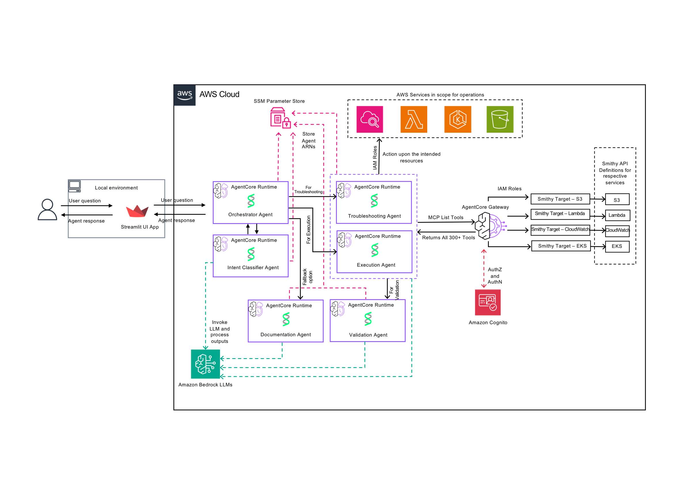
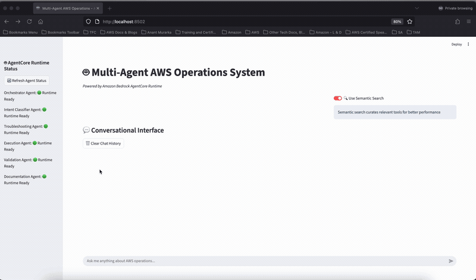

# Multi-Agent AWS Operations with Amazon Bedrock AgentCore Semantic Search

A multi-agent system demonstrating Amazon Bedrock AgentCore Gateway's semantic search capabilities for intelligent tool curation across AWS service operations, troubleshooting, and automated remediation.

## ⚠️ Important Disclaimers

**This is a code sample for demonstration purposes only. Do not use in production environments without proper security review, testing, and hardening.**

**Responsible AI:** This system includes automated AWS operations capabilities. Users are responsible for ensuring appropriate safeguards, monitoring, and human oversight when deploying AI-driven infrastructure management tools.

## Overview

This project demonstrates a multi-agent orchestration system built on Amazon Bedrock AgentCore, showcasing how AgentCore Gateway's semantic search capabilities enable intelligent tool curation from large API catalogs. The system coordinates six specialized agents to handle AWS operations and troubleshooting through natural language interactions.

**Key Capabilities:**
- **Multi-Agent Orchestration**: Hub-and-spoke pattern with specialized agents for different operational domains
- **Semantic Search**: Intelligent tool curation reducing 300+ tools for AWS operations to 10-15 relevant tools per query
- **Automated Operations**: Natural language AWS environment and operations management with automated fix application
- **Context Preservation**: Multi-turn conversational AI maintaining context across interactions
- **Audit Trail**: Complete tracking of automated changes and operations

### Use Case Details

| Information         | Details                                                                                      |
|---------------------|----------------------------------------------------------------------------------------------|
| Use case type       | Multi-Agent Orchestration with Semantic Search                                               |
| Agent type          | Multi-Agent System (6 specialized agents)                                                    |
| Use case components | AgentCore Gateway, AgentCore Runtime, Cognito, S3, SSM, CloudWatch      |
| Use case vertical   | AWS Operations & DevOps Automation                                                           |
| Example complexity  | Advanced                                                                                     |
| SDK used            | boto3, strands-agents, streamlit, mcp                                                        |

## AgentCore Gateway

**Amazon Bedrock AgentCore Gateway** provides an easy and secure way to build, deploy, discover, and connect to tools at scale. Gateway converts APIs, Lambda functions, and existing services into Model Context Protocol (MCP)-compatible tools, making them available to agents through Gateway endpoints. The Gateway serves as a fully-managed, serverless interface layer between agents and backend services, offering:

- **Tool Integration at Scale**: Transform existing enterprise resources into agent-ready tools with just a few lines of code
- **Unified Access**: Single MCP endpoint for accessing multiple tool sources (OpenAPI, Smithy models, Lambda functions)
- **Comprehensive Authentication**: Manages both ingress authentication (verifying agent identity) and egress authentication (connecting to tools) with OAuth2 and JWT support
- **Framework Compatibility**: Works with popular frameworks including CrewAI, LangGraph, LlamaIndex, and Strands Agents
- **Serverless Infrastructure**: Fully-managed service with automatic scaling, built-in observability, and auditing
- **Semantic Tool Selection**: Intelligent tool curation from large API catalogs using contextual search

### AgentCore Gateway Semantic Search

This project leverages **AgentCore Gateway's semantic search capabilities** to address one of the most challenging problems in enterprise AI agent development: efficiently managing and selecting from hundreds or thousands of available tools.

**The Challenge**

Traditional approaches to tool selection require agents to process extensive tool metadata in their prompts, creating significant challenges:

- **Context Limit Constraints**: Tool sets frequently exceed LLM context limits (268+ AWS operations in this project)
- **Poor Tool Selection**: Agents struggle to choose optimal tools from extensive lists, leading to hallucinations and incorrect selections
- **High Latency**: Processing hundreds of tool descriptions significantly delays response times
- **Cost Escalation**: Large tool catalogs consume substantial tokens, increasing operational costs
- **Scalability Issues**: Enterprise SaaS integrations (Salesforce, Zendesk, Slack, JIRA) each expose 50-200+ API endpoints

**The Solution: Gateway Semantic Search**

AgentCore Gateway's semantic search capability revolutionizes tool selection by enabling agents to intelligently discover and select only the most relevant tools for a given context or question. Using vector-based similarity matching, Gateway semantic search:

- **Intelligent Tool Discovery**: Finds relevant tools based on natural language queries and conversation context
- **Context-Aware Selection**: Filters tools based on current conversation context, not just keywords
- **Dynamic Curation**: Returns only 10-15 highly relevant tools instead of all 268+ operations
- **Scalable Architecture**: Supports enterprise-scale tool inventories without performance degradation

**Built-in Search Tool**: Gateway provides a special `x_amz_bedrock_agentcore_search` tool accessible via the Model Context Protocol (MCP) for intelligent tool discovery at scale.


## Architecture

This multi-agent system implements a hub-and-spoke orchestration pattern where a central Orchestrator coordinates five specialized sub-agents, each focused on specific operational domains. The AgentCore Gateway with semantic search serves as the intelligent tool curation layer, enabling efficient interaction with AWS services.

### Architecture Diagrams

**Without Semantic Search:**



In the traditional approach, all 268+ AWS API operations are loaded into the agent's context, leading to tool confusion, slower responses, and higher costs.

**With Semantic Search:**


With Gateway semantic search enabled, agents query the Gateway to discover only the 10-15 most relevant tools for each request, dramatically improving performance and accuracy.

### System Components

#### Multi-Agent System

**Orchestrator Agent** (Central Hub)
- Coordinates all sub-agent interactions
- Manages conversation state and context
- Routes requests based on intent classification
- Aggregates responses from multiple agents
- Maintains audit trail of operations

**Intent Classifier Agent**
- Analyzes user queries to determine intent
- Routes requests to appropriate specialized agents
- Handles ambiguous queries with clarification
- Supports multi-intent detection

**Troubleshooting Agent**
- Diagnoses AWS service issues and failures
- Identifies root causes of problems
- Recommends and applies automated fixes
- Validates fix effectiveness

**Execution Agent**
- Handles standard AWS operations (list, describe, get)
- Executes infrastructure changes
- Manages resource lifecycle operations
- Provides operation status and results

**Validation Agent**
- Verifies applied changes and configurations
- Checks resource states post-operation
- Validates compliance with best practices
- Reports validation results

**Documentation Agent**
- Retrieves AWS service documentation
- Provides best practice guidance
- Explains AWS concepts and features
- Answers technical questions
- **Fallback Agent**: When no relevant tools are returned by Gateway search, provides contextual information about the requested operation

#### AgentCore Gateway

The Gateway serves as the intelligent interface between agents and the tools/APIs needed to operate on AWS services:

- **MCP Protocol Support**: Standard Model Context Protocol for agent integration
- **Multi-Service Integration**: Unified interface to S3, Lambda, EKS, CloudWatch APIs (268+ operations)
- **Authentication**: JWT-based authentication with Cognito OAuth integration

**With Semantic Search Enabled:**
- **Intelligent Tool Discovery**: Vector-based tool curation from large API catalogs
- **Context-Aware Selection**: Returns only 10-15 relevant tools per query instead of all 268+ operations
- **Built-in Search Tool**: Special `x_amz_bedrock_agentcore_search` tool for dynamic tool discovery
- **Performance Optimization**: Reduces agent context size, latency, and token costs

**Without Semantic Search:**
- All 268+ AWS operations loaded into agent context
- Agents must process entire tool catalog for every request
- Higher latency, increased costs, and tool selection confusion

#### Supporting Infrastructure

**Amazon Cognito**
- User authentication and authorization
- OAuth 2.0 token management
- JWT token generation for Gateway access

**Amazon S3**
- Storage for API schema definitions (Smithy models)
- Configuration file storage
- Audit log archival

**AWS Systems Manager (SSM) Parameter Store**
- Agent ARN storage for dynamic discovery
- Configuration parameter management
- Secure credential storage

**Amazon CloudWatch**
- Agent execution logs
- Performance metrics and monitoring
- Operational dashboards

### Multi-Agent Orchestration Pattern

The system implements a **hub-and-spoke** communication pattern:

1. **User Interaction**: User submits natural language query via Streamlit UI

2. **Orchestrator Reception**: Orchestrator Agent receives query and initiates processing

3. **Intent Classification**: Orchestrator invokes Intent Classifier to determine query type

4. **Agent Routing**: Based on intent, Orchestrator routes to appropriate specialized agent(s):
   - Troubleshooting queries → Troubleshooting Agent
   - Standard operations → Execution Agent
   - Documentation requests → Documentation Agent
   - Change verification → Validation Agent
   - No relevant tools found → Documentation Agent (fallback)

5. **Tool Discovery**: Specialized agents query Gateway using semantic search to discover relevant tools

6. **Tool Curation**: Gateway returns 10-15 semantically relevant operations (vs 268+ total)

7. **Operation Execution**: Agents execute selected tools through Gateway

8. **Response Aggregation**: Orchestrator collects responses from all invoked agents

9. **User Response**: Orchestrator formats and returns comprehensive response to UI

### Data Flow

```
User Query
    ↓
Streamlit UI
    ↓
Orchestrator Agent (AgentCore Runtime)
    ↓
Intent Classifier Agent
    ↓
Specialized Agent (Troubleshooting/Execution/Documentation)
    ↓
AgentCore Gateway (Interface to Tools/APIs with Semantic Search)
    ↓
Tools/APIs
    ↓
Specialized Agent (executes operations)
    ↓
AWS Services (S3, Lambda, EKS, CloudWatch)
    ↓
Validation Agent (verifies changes)
    ↓
Orchestrator Agent
    ↓
Streamlit UI
    ↓
User
```


## Prerequisites

### AWS Account Requirements

- **AWS Account** with appropriate IAM permissions (see Required IAM Permissions section below)
- **AWS Region**: Any region where Amazon Bedrock AgentCore is available (e.g., us-east-1, us-west-2)
- **Amazon Bedrock Model Access**: Anthropic Claude 3.7 Sonnet (or later) enabled in your account
  - Navigate to Amazon Bedrock console → Model access → Enable Claude 3.7 Sonnet
  - **Note**: This tutorial was written using Claude 3.7 Sonnet. As models evolve through their lifecycle, use the most recent and available Claude model in your region and ensure you have access enabled for it.

### Required IAM Permissions

Your AWS user or role must have permissions for the following services:

- **Amazon Bedrock AgentCore**: Runtime and control plane operations
  - `bedrock:*` (for AgentCore Runtime, Gateway, and Identity operations)
- **AWS Identity and Access Management (IAM)**: Role and policy management
  - `iam:CreateRole`, `iam:AttachRolePolicy`, `iam:PassRole`
- **Amazon Elastic Container Registry (ECR)**: Container image storage
  - `ecr:CreateRepository`, `ecr:PutImage`, `ecr:BatchGetImage`
- **AWS Systems Manager (SSM)**: Parameter storage
  - `ssm:PutParameter`, `ssm:GetParameter`
- **Amazon CloudWatch Logs**: Log management
  - `logs:CreateLogGroup`, `logs:PutLogEvents`
- **Amazon Cognito**: User pool management
  - `cognito-idp:CreateUserPool`, `cognito-idp:CreateUserPoolClient`
- **Amazon S3**: Bucket and object operations
  - `s3:CreateBucket`, `s3:PutObject`, `s3:GetObject`
- **AWS Lambda**: Function management (for demo scenarios)
  - `lambda:CreateFunction`, `lambda:UpdateFunctionConfiguration`

### Local Environment Setup

**Python 3.10 or higher**
```bash
# Check Python version
python3 --version
# Should output: Python 3.10.x or higher
```

**AWS CLI 2.x**
```bash
# Check AWS CLI version
aws --version
# Should output: aws-cli/2.x.x or higher

# Configure AWS credentials
aws configure
# Enter your AWS Access Key ID, Secret Access Key, and default region
```

**Clone Repository**
```bash
# Clone the repository
git clone https://github.com/aws-samples/sample-aws-ops-agentcore-gateway-search.git
cd sample-aws-ops-agentcore-gateway-search/agentcore-search
```

**Required Python Packages**
```bash
# Install required packages from requirements.txt
pip install -r requirements.txt
```

### Required Files: AWS API Definitions

This project requires AWS API definition files in Smithy JSON format. These files define the AWS service operations that the Gateway will expose to agents.

**Download AWS API Definitions:**

1. Create the directory structure:
```bash
mkdir -p agentcore-search/smithy/api-definitions
```

2. Download API definition files from the AWS API models repository:
   - Repository: https://github.com/aws/api-models-aws/tree/main/models
   
3. Download and save these files to `agentcore-search/smithy/api-definitions/`:
   - **s3-apis.json**: From `s3/service/2006-03-01/s3-2006-03-01.json`
   - **lambda-apis.json**: From `lambda/service/2015-03-31/lambda-2015-03-31.json`
   - **eks-apis.json**: From `eks/service/2017-11-01/eks-2017-11-01.json`
   - **cloudwatch-logs-apis.json**: From `cloudwatch-logs/service/2014-03-28/cloudwatch-logs-2014-03-28.json`

**Note**: These Smithy JSON files contain the complete API specifications that the Gateway will use to generate tool definitions for agents.

### Prerequisite Checks

Before proceeding with deployment, verify all prerequisites:

```bash
# Check Python version (should be 3.10+)
python3 --version

# Check AWS CLI version (should be 2.x)
aws --version

# Verify AWS credentials are configured
aws sts get-caller-identity

# Verify you're in the correct region
aws configure get region
# Should output: us-east-1

# Check Bedrock model access (should list Claude 3.7 Sonnet)
aws bedrock list-foundation-models --region us-east-1 --query 'modelSummaries[?contains(modelId, `claude-3-7-sonnet`)].modelId'

# Verify API definition files exist
ls -la agentcore-search/smithy/api-definitions/
# Should show: s3-apis.json, lambda-apis.json, eks-apis.json, cloudwatch-logs-apis.json
```

If any prerequisite check fails, resolve the issue before proceeding with deployment.

## Setup Instructions

Follow these steps to deploy the multi-agent system to Amazon Bedrock AgentCore.

### Step 1: Set Environment Variables

```bash
# Set AWS region environment variable
export AWS_DEFAULT_REGION=<your-region>

# Verify you're in the correct directory
pwd
# Should output: .../agentcore-samples/agentcore-search
```

### Step 2: Deploy Gateway Infrastructure

The Gateway provides the semantic search capabilities and tool curation layer for all agents.

```bash
# Navigate to gateway directory
cd gateway

# Run gateway setup script
python3 gateway_setup.py
```

**What this creates:**
- **AgentCore Gateway** with semantic search enabled (`enable_semantic_search=True`)
- **Amazon Cognito User Pool** for authentication and OAuth token management
- **Amazon S3 Bucket** for storing API schema definitions (Smithy models)
- **Configuration Files** saved to `config/` directory for agent deployment

**Expected Output:**
```
Creating Cognito user pool...
Creating S3 bucket for schemas...
Uploading API definitions to S3...
Creating AgentCore Gateway with semantic search...
Gateway created successfully: <gateway-id>
Configuration saved to config/gateway_config.json
```

**Deployment Time**: Approximately 3-5 minutes

### Step 3: Deploy Agents to AgentCore Runtime

Deploy all six agents (Orchestrator, Intent Classifier, Troubleshooting, Execution, Validation, Documentation) to AgentCore Runtime.

```bash
# Navigate to agents directory
cd ../agentcore-runtime/agents

# Run deployment script for all agents
python3 deploy_all_agents.py
```

**What this creates for each agent:**
- **Amazon ECR Repository** for storing agent container images
- **Container Image Build** with agent code and dependencies
- **IAM Execution Role** with required permissions for agent operations
- **AgentCore Runtime Deployment** with agent configuration
- **SSM Parameters** for agent ARN storage and discovery

**Expected Output:**
```
Deploying agent: orchestrator
  Creating ECR repository...
  Building container image...
  Pushing image to ECR...
  Creating IAM role...
  Deploying to AgentCore Runtime...
  Saving ARN to SSM Parameter Store...
  Agent deployed successfully: <agent-arn>

Deploying agent: intent-classifier
  ...

[Continues for all 6 agents]

All agents deployed successfully!
```

**Deployment Time**: Approximately 5-7 minutes (all agents deployed in parallel)

**Note**: The deployment script builds Docker containers for each agent and pushes them to ECR. This process is time-intensive but only needs to be done once.

### Step 4: Configure Agent Permissions

Configure the Orchestrator agent with permissions to invoke all sub-agents.

```bash
# Still in agentcore-runtime/agents directory
python3 update_agent_permissions.py
```

**What this configures:**
- **Orchestrator Invoke Permissions**: Allows Orchestrator to invoke all five sub-agents
- **SSM Parameter Access**: Grants agents access to read configuration from Parameter Store
- **Gateway Access**: Ensures all agents can access the Gateway for tool discovery

**Expected Output:**
```
Retrieving agent ARNs from SSM...
Updating orchestrator permissions...
  Adding permission to invoke: intent-classifier
  Adding permission to invoke: troubleshooting-agent
  Adding permission to invoke: execution-agent
  Adding permission to invoke: validation-agent
  Adding permission to invoke: documentation-agent
Permissions updated successfully!
```

**Deployment Time**: Less than 1 minute

### Step 5: Create Demo Scenarios (Optional)

Create test AWS resources with intentional issues to demonstrate the system's troubleshooting and automated fix capabilities.

```bash
# Navigate to demo scenarios directory
cd ../../demo_scenarios

# Create Lambda function with performance issues
python3 run_scenario.py lambda

# Create S3 bucket with security configuration gaps
python3 run_scenario.py s3

# Create resources missing CloudWatch monitoring
python3 run_scenario.py cloudwatch
```

**What this creates:**
- **Lambda Scenario**: Function with low memory, no timeout, missing environment variables
- **S3 Scenario**: Bucket with public access, no encryption, no versioning
- **CloudWatch Scenario**: Resources without proper logging and monitoring configuration

**Expected Output:**
```
Creating Lambda scenario resources...
  Created function: agentcore-demo-lambda-perf
  Applied performance issues: low memory, no timeout
  Scenario ready for testing

Creating S3 scenario resources...
  Created bucket: agentcore-demo-s3-security-<random>
  Applied security gaps: public access, no encryption
  Scenario ready for testing

Creating CloudWatch scenario resources...
  Created resources without monitoring
  Scenario ready for testing
```

**Note**: These scenarios are optional but recommended for testing the system's automated troubleshooting and fix capabilities.

### Step 6: Launch User Interface

Launch the Streamlit web interface to interact with the multi-agent system.

```bash
# Navigate to runtime directory
cd ../agentcore-runtime

# Launch Streamlit UI
streamlit run multi_agent_runtime_app.py --server.port 8502
```

**Expected Output:**
```
  You can now view your Streamlit app in your browser.

  Local URL: http://localhost:8502
  Network URL: http://<your-ip>:8502
```

**Access the UI**: Open your browser and navigate to `http://localhost:8502`

### Deployment Verification

After completing all steps, verify the deployment:

1. **Check UI Launch**: UI should load without errors
2. **Verify Agent Status**: Sidebar should show all 6 agents with "Runtime Ready" status
3. **Test Basic Query**: Enter "List my S3 buckets" and verify response
4. **Check Semantic Search**: Review "Tools Used" tab to see curated tools (should show 10-15 tools, not 268+)

If any verification step fails, check the Troubleshooting section below.

## Execution Instructions

### User Interface Overview

The UI provides a comprehensive interface for interacting with the multi-agent system:

**Main Chat Interface:**
- Natural language input field for queries
- Real-time response streaming
- Multi-turn conversation support with context preservation

**Agent Status Sidebar:**
- Real-time connectivity status for all 6 agents
- Agent ARNs retrieved dynamically from SSM Parameter Store
- Status indicators: "Runtime Ready" (green) or "Not Available" (red)

**Four-Tab Response View:**
1. **Response Tab**: Agent responses, actions taken, and results
2. **Tools Used Tab**: Semantic search results showing curated tools selected by Gateway
3. **Fixes Applied Tab**: Audit trail of automated changes with before/after states
4. **Metrics Tab**: Performance statistics including response times and success rates

### Sample Prompts for Testing

#### Basic Operations

Test standard AWS operations to verify agent connectivity and Gateway integration:

```
List my S3 buckets
```
**Expected**: Execution Agent lists all S3 buckets in your account

```
Show me my Lambda functions
```
**Expected**: Execution Agent retrieves and displays Lambda functions

```
Describe my EKS clusters
```
**Expected**: Execution Agent provides EKS cluster information

#### Troubleshooting and Automated Fixes

Test the system's ability to diagnose issues and apply automated fixes:

```
My Lambda function agentcore-demo-lambda-perf has performance issues
```
**Expected**: 
- Troubleshooting Agent diagnoses low memory, missing timeout configuration
- Applies automated fixes: increases memory, sets timeout, adds environment variables
- Validation Agent verifies changes were applied correctly
- "Fixes Applied" tab shows complete audit trail

```
Check my S3 bucket agentcore-demo-s3-security-<random> for security issues
```
**Expected**:
- Troubleshooting Agent identifies security gaps: public access, no encryption, no versioning
- Applies automated fixes: blocks public access, enables encryption, enables versioning
- Validation Agent confirms security improvements
- "Fixes Applied" tab documents all changes

```
My CloudWatch logs aren't configured properly
```
**Expected**:
- Troubleshooting Agent identifies missing log groups and retention policies
- Creates log groups and configures retention
- Sets up appropriate monitoring

#### Documentation Queries

Test the Documentation Agent's ability to provide AWS guidance:

```
How do I configure CloudWatch alarms for Lambda functions?
```
**Expected**: Documentation Agent provides step-by-step guidance with best practices

```
What are the best practices for S3 bucket security?
```
**Expected**: Documentation Agent explains security recommendations

```
Explain Lambda function timeout configuration
```
**Expected**: Documentation Agent provides detailed explanation

#### Multi-Turn Conversations

Test context preservation across multiple interactions:

```
User: What Lambda functions do I have?
Agent: [Lists Lambda functions]

User: Check the first one for issues
Agent: [Analyzes first function from previous response]

User: Fix any problems you found
Agent: [Applies fixes to the same function]
```

**Expected**: Agent maintains context and references previous responses correctly

### Observing Semantic Search in Action

To see semantic search working:

1. **Enter a query**: "My Lambda function has performance issues"

2. **Check Tools Used tab**: 
   - Should show 10-15 curated tools
   - Tools should be relevant: Lambda configuration, CloudWatch metrics, performance tuning
   - Should NOT show all 268+ AWS operations

3. **Compare response time**:
   - With semantic search: 20-35 seconds
   - Without semantic search: 80-150 seconds (if you disable it)

4. **Observe accuracy**:
   - Agent should select correct tools for the task
   - No hallucinations or incorrect tool usage
   - Precise, targeted operations

### Demo



*Demo showing the multi-agent system handling AWS operations with semantic search-powered tool curation*

### Performance Benefits

Gateway semantic search delivers dramatic improvements in agent performance, cost, and accuracy:

| Metric                  | Without Semantic Search | With Semantic Search | Improvement      |
|-------------------------|-------------------------|----------------------|------------------|
| Response Time           | 80-150 seconds          | 20-35 seconds        | **Up to 3x faster**  |
| Tools Returned per Query| 268+ operations         | 10-15 operations     | **95% reduction**|
| Token Usage             | High (all tool descriptions) | Low (relevant tools only) | **Dramatic cost reduction** |
| Success Rate            | Variable (60-70%)       | 95%+                 | **Significant**  |
| Agent Accuracy          | Lower (tool confusion)  | Higher (focused)     | **95%+ correct** |

**Key Benefits:**
- **Performance Optimization**: Up to 3x latency improvement by focusing on relevant tools
- **Cost Reduction**: Dramatically reduced token usage through targeted tool selection
- **Improved Accuracy**: Agents select the right tools without being overwhelmed by irrelevant options
- **Enterprise Scale**: Handles hundreds or thousands of tools without degrading performance

### Tips for Effective Use

- **Be specific**: More detailed queries lead to better tool curation and results
- **Use natural language**: No need for technical AWS API syntax
- **Check all tabs**: Important information is distributed across the four tabs
- **Review fixes**: Always check "Fixes Applied" tab to see what changes were made
- **Multi-turn conversations**: Ask follow-up questions to leverage context preservation
- **Monitor metrics**: Use "Metrics" tab to track system performance over time

## Cleanup Instructions

When you're finished with the multi-agent system, clean up AWS resources to avoid ongoing charges.

### Complete Cleanup (Recommended)

Remove all resources created by this project:

```bash
# From the agentcore-search directory
python3 cleanup_workshop_resources.py
```

**What this removes:**
- All 6 AgentCore Runtime agents (Orchestrator, Intent Classifier, Troubleshooting, Execution, Validation, Documentation)
- AgentCore Gateway with semantic search configuration
- Amazon ECR repositories and container images
- IAM roles and policies created for agents
- Amazon Cognito user pool and clients
- Amazon S3 bucket with API schemas
- SSM parameters storing agent ARNs
- CloudWatch log groups
- Demo scenario resources (Lambda functions, S3 buckets, etc.)

**Expected Output:**
```
Starting cleanup of AgentCore resources...

Cleaning up AgentCore Runtime agents...
  Deleting agent: orchestrator
  Deleting agent: intent-classifier
  Deleting agent: troubleshooting-agent
  Deleting agent: execution-agent
  Deleting agent: validation-agent
  Deleting agent: documentation-agent

Cleaning up AgentCore Gateway...
  Deleting gateway: <gateway-id>

Cleaning up ECR repositories...
  Deleting repository: orchestrator
  [continues for all repositories]

Cleaning up IAM roles...
  Deleting role: agentcore-orchestrator-role
  [continues for all roles]

Cleaning up Cognito resources...
  Deleting user pool: <pool-id>

Cleaning up S3 resources...
  Emptying bucket: <bucket-name>
  Deleting bucket: <bucket-name>

Cleaning up SSM parameters...
  Deleting parameter: /agentcore/agents/orchestrator/arn
  [continues for all parameters]

Cleaning up CloudWatch log groups...
  Deleting log group: /aws/bedrock-agentcore/runtimes/orchestrator-DEFAULT
  [continues for all log groups]

Cleaning up demo scenario resources...
  Deleting Lambda function: agentcore-demo-lambda-perf
  Deleting S3 bucket: agentcore-demo-s3-security-<random>
  [continues for all demo resources]

Cleanup completed successfully!
```

**Cleanup Time**: Approximately 5-10 minutes

### Selective Cleanup

Clean up specific components while preserving others:

**Clean up only AgentCore Runtime agents:**
```bash
python3 cleanup_workshop_resources.py --service agentcore
```

**Clean up only Gateway infrastructure:**
```bash
python3 cleanup_workshop_resources.py --service gateway
```

**Clean up only demo scenario resources:**
```bash
python3 cleanup_workshop_resources.py --service scenarios
```

**Clean up only supporting infrastructure (Cognito, S3, SSM):**
```bash
python3 cleanup_workshop_resources.py --service infrastructure
```

### Dry-Run Preview

Preview what will be deleted without actually removing resources:

```bash
python3 cleanup_workshop_resources.py --dry-run
```

**Expected Output:**
```
DRY RUN MODE - No resources will be deleted

The following resources would be deleted:

AgentCore Runtime Agents:
  - orchestrator (arn:aws:bedrock:us-east-1:...)
  - intent-classifier (arn:aws:bedrock:us-east-1:...)
  - troubleshooting-agent (arn:aws:bedrock:us-east-1:...)
  - execution-agent (arn:aws:bedrock:us-east-1:...)
  - validation-agent (arn:aws:bedrock:us-east-1:...)
  - documentation-agent (arn:aws:bedrock:us-east-1:...)

AgentCore Gateway:
  - Gateway ID: <gateway-id>

ECR Repositories:
  - orchestrator
  - intent-classifier
  [continues...]

IAM Roles:
  - agentcore-orchestrator-role
  - agentcore-intent-classifier-role
  [continues...]

S3 Buckets:
  - <bucket-name>

Cognito User Pools:
  - <pool-id>

SSM Parameters:
  - /agentcore/agents/orchestrator/arn
  [continues...]

CloudWatch Log Groups:
  - /aws/bedrock-agentcore/runtimes/orchestrator-DEFAULT
  [continues...]

Demo Resources:
  - Lambda: agentcore-demo-lambda-perf
  - S3: agentcore-demo-s3-security-<random>
  [continues...]

Total estimated resources: XX

Run without --dry-run to perform cleanup.
```

### Manual Cleanup (If Automated Cleanup Fails)

If the automated cleanup script encounters errors, you can manually delete resources:

**1. Delete AgentCore Runtime Agents:**
```bash
# List agents
aws bedrock-agent-runtime list-agents --region us-east-1

# Delete each agent
aws bedrock-agent delete-agent --agent-id <agent-id> --region us-east-1
```

**2. Delete AgentCore Gateway:**
```bash
# List gateways
aws bedrock-agent list-gateways --region us-east-1

# Delete gateway
aws bedrock-agent delete-gateway --gateway-id <gateway-id> --region us-east-1
```

**3. Delete ECR Repositories:**
```bash
# List repositories
aws ecr describe-repositories --region us-east-1

# Delete each repository
aws ecr delete-repository --repository-name <repo-name> --force --region us-east-1
```

**4. Delete IAM Roles:**
```bash
# List roles with agentcore prefix
aws iam list-roles --query 'Roles[?contains(RoleName, `agentcore`)].RoleName'

# Detach policies and delete each role
aws iam detach-role-policy --role-name <role-name> --policy-arn <policy-arn>
aws iam delete-role --role-name <role-name>
```

**5. Delete Cognito User Pool:**
```bash
# List user pools
aws cognito-idp list-user-pools --max-results 10 --region us-east-1

# Delete user pool
aws cognito-idp delete-user-pool --user-pool-id <pool-id> --region us-east-1
```

**6. Delete S3 Bucket:**
```bash
# Empty bucket first
aws s3 rm s3://<bucket-name> --recursive

# Delete bucket
aws s3 rb s3://<bucket-name>
```

**7. Delete SSM Parameters:**
```bash
# List parameters
aws ssm describe-parameters --region us-east-1 --query 'Parameters[?contains(Name, `agentcore`)].Name'

# Delete each parameter
aws ssm delete-parameter --name <parameter-name> --region us-east-1
```

**8. Delete CloudWatch Log Groups:**
```bash
# List log groups
aws logs describe-log-groups --log-group-name-prefix /aws/bedrock-agentcore --region us-east-1

# Delete each log group
aws logs delete-log-group --log-group-name <log-group-name> --region us-east-1
```

### Verification After Cleanup

Verify all resources have been removed:

```bash
# Check for remaining agents
aws bedrock-agent-runtime list-agents --region us-east-1

# Check for remaining gateways
aws bedrock-agent list-gateways --region us-east-1

# Check for remaining ECR repositories
aws ecr describe-repositories --region us-east-1 | grep agentcore

# Check for remaining IAM roles
aws iam list-roles --query 'Roles[?contains(RoleName, `agentcore`)].RoleName'

# Check for remaining S3 buckets
aws s3 ls | grep agentcore

# Check for remaining SSM parameters
aws ssm describe-parameters --region us-east-1 --query 'Parameters[?contains(Name, `agentcore`)].Name'
```

All commands should return empty results or no matches if cleanup was successful.

### Cost Considerations

**Resources that incur costs:**
- **AgentCore Runtime**: Pay only for active resources consumed based on CPU and memory consumption across session lifetime
- **AgentCore Gateway**: Consumption-based pricing for MCP operations (ListTools, CallTool, Ping), search queries, and tools indexed for semantic search
- **Amazon Bedrock**: Model inference costs (per token for Claude 3.7 Sonnet)
- **ECR storage**: Per GB-month for container images
- **S3 storage**: Per GB-month for API schemas and configurations
- **CloudWatch Logs**: Per GB-month for log storage
- **Cognito**: Per monthly active user

**Note**: AgentCore Runtime and Gateway use consumption-based pricing - you only pay for actual usage. Storage costs (ECR, S3, CloudWatch Logs) continue to accrue until resources are deleted. For detailed pricing, refer to the [Amazon Bedrock AgentCore Pricing](https://aws.amazon.com/bedrock/agentcore/pricing/) and [Amazon Bedrock Pricing](https://aws.amazon.com/bedrock/pricing/) pages.

## Troubleshooting

### Agent Deployment Issues

**Problem**: Agent deployment fails

**Solution**:
```bash
# Check specific agent logs
aws logs tail /aws/bedrock-agentcore/runtimes/<agent-name>-DEFAULT --follow --region us-east-1

# Redeploy specific agent
cd agentcore-runtime/agents
python3 deploy_all_agents.py --agent <agent-name>
```

### Gateway Authentication Problems

**Problem**: Gateway returns 401 Unauthorized errors

**Solution**:
```bash
# Refresh Cognito authentication tokens
cd gateway
python3 -c "from ui_config import refresh_access_token; refresh_access_token()"

# Verify Cognito configuration
cat config/cognito_config.json

# Check Gateway configuration
cat config/gateway_config.json
```

### Permission Errors

**Problem**: Orchestrator cannot invoke sub-agents

**Solution**:
```bash
# Update orchestrator permissions
cd agentcore-runtime/agents
python3 update_agent_permissions.py

# Verify IAM role policies
aws iam list-attached-role-policies --role-name agentcore-orchestrator-role

# Check SSM parameters exist
aws ssm get-parameters-by-path --path /agentcore/agents --region us-east-1
```

### UI Connection Issues

**Problem**: UI shows agents as "Not Available"

**Solution**:
1. Check agent status in sidebar - should show "Runtime Ready"
2. Verify SSM parameters contain correct agent ARNs:
   ```bash
   aws ssm get-parameter --name /agentcore/agents/orchestrator/arn --region us-east-1
   ```
3. Restart the UI:
   ```bash
   # Stop Streamlit (Ctrl+C)
   # Restart
   streamlit run multi_agent_runtime_app.py --server.port 8502
   ```
4. Check CloudWatch logs for errors:
   ```bash
   aws logs tail /aws/bedrock-agentcore/runtimes/orchestrator-DEFAULT --follow --region us-east-1
   ```

### Semantic Search Not Working

**Problem**: Gateway returns all 268+ tools instead of 10-15 curated tools

**Solution**:
1. Verify Gateway was created with semantic search enabled:
   ```bash
   aws bedrock-agent get-gateway --gateway-id <gateway-id> --region us-east-1 --query 'gateway.semanticSearchEnabled'
   ```
2. Check MCP configuration in `gateway/config/mcp-client-config.json`:
   ```json
   {
     "protocolConfiguration": {
       "mcp": {
         "searchType": "SEMANTIC"
       }
     }
   }
   ```
3. If semantic search is disabled, redeploy the Gateway:
   ```bash
   cd gateway
   python3 gateway_setup.py --enable-semantic-search
   ```

### Slow Response Times

**Problem**: Queries take longer than expected (>60 seconds)

**Possible Causes and Solutions**:
1. **Semantic search disabled**: Verify semantic search is enabled (see above)
2. **Cold start**: First query after deployment may be slow due to container initialization
3. **Large API catalog**: Ensure API definitions are properly formatted and not excessively large
4. **Network issues**: Check AWS region latency and connectivity

### Common Error Messages

**Error**: `ResourceNotFoundException: Agent not found`
- **Cause**: Agent ARN in SSM Parameter Store is incorrect or agent was deleted
- **Solution**: Redeploy the agent or update SSM parameter with correct ARN

**Error**: `AccessDeniedException: User is not authorized`
- **Cause**: IAM permissions missing or Cognito token expired
- **Solution**: Update IAM policies and refresh Cognito tokens

**Error**: `ValidationException: Invalid API definition`
- **Cause**: Smithy JSON files are malformed or missing required fields
- **Solution**: Re-download API definition files from AWS API models repository

**Error**: `ThrottlingException: Rate exceeded`
- **Cause**: Too many requests to AgentCore or Bedrock APIs
- **Solution**: Implement exponential backoff or reduce request frequency

## Project Structure

```
agentcore-search/
├── README.md                           # This file
├── static/                             # Visual assets
│   ├── architecture-with-search.png    # Architecture diagram
│   └── multi_agent_demo.gif            # UI demonstration
│
├── agentcore-runtime/                  # AgentCore Runtime deployment
│   ├── multi_agent_runtime_app.py      # Streamlit UI application
│   ├── requirements.txt                # Python dependencies
│   └── agents/                         # Agent implementations
│       ├── deploy_all_agents.py        # Automated deployment script
│       ├── update_agent_permissions.py # Permission configuration script
│       ├── create_agent_roles.py       # IAM role creation
│       ├── refresh_tokens.py           # Token refresh utility
│       │
│       ├── orchestrator/               # Central coordinator agent
│       │   ├── orchestrator.py         # Main orchestrator logic
│       │   ├── base_agent.py           # Base agent class
│       │   ├── conversation_manager.py # Conversation state management
│       │   ├── invoke_agent_utils.py   # Sub-agent invocation utilities
│       │   ├── intent_classifier.py    # Intent classifier integration
│       │   ├── troubleshooting_agent.py# Troubleshooting agent integration
│       │   ├── execution_agent.py      # Execution agent integration
│       │   ├── validation_agent.py     # Validation agent integration
│       │   ├── documentation_agent.py  # Documentation agent integration
│       │   ├── gateway_config.py       # Gateway configuration
│       │   ├── ui_config.py            # UI configuration
│       │   ├── utils.py                # Utility functions
│       │   └── requirements.txt        # Agent-specific dependencies
│       │
│       ├── intent_classifier/          # Request routing agent
│       │   ├── intent_classifier.py    # Intent classification logic
│       │   ├── base_agent.py
│       │   ├── conversation_manager.py
│       │   ├── gateway_config.py
│       │   ├── ui_config.py
│       │   ├── utils.py
│       │   └── requirements.txt
│       │
│       ├── troubleshooting_agent/      # Issue resolution agent
│       │   ├── troubleshooting_agent.py# Troubleshooting logic
│       │   ├── base_agent.py
│       │   ├── conversation_manager.py
│       │   ├── fix_action.py           # Automated fix application
│       │   ├── gateway_config.py
│       │   ├── ui_config.py
│       │   ├── utils.py
│       │   └── requirements.txt
│       │
│       ├── execution_agent/            # AWS operations agent
│       │   ├── execution_agent.py      # Execution logic
│       │   ├── base_agent.py
│       │   ├── conversation_manager.py
│       │   ├── fix_action.py
│       │   ├── gateway_config.py
│       │   ├── ui_config.py
│       │   ├── utils.py
│       │   └── requirements.txt
│       │
│       ├── validation_agent/           # Change verification agent
│       │   ├── validation_agent.py     # Validation logic
│       │   ├── base_agent.py
│       │   ├── conversation_manager.py
│       │   ├── fix_action.py
│       │   ├── gateway_config.py
│       │   ├── ui_config.py
│       │   ├── utils.py
│       │   └── requirements.txt
│       │
│       └── documentation_agent/        # AWS documentation agent
│           ├── documentation_agent.py  # Documentation retrieval logic
│           ├── base_agent.py
│           ├── conversation_manager.py
│           ├── fix_action.py
│           ├── gateway_config.py
│           ├── ui_config.py
│           ├── utils.py
│           └── requirements.txt
│
├── gateway/                            # Gateway infrastructure
│   ├── gateway_setup.py                # Gateway deployment script
│   ├── gateway_config.py               # Gateway configuration utilities
│   ├── ui_config.py                    # UI configuration utilities
│   ├── utils.py                        # AWS utility functions
│   └── config/                         # Generated configuration files
│       ├── gateway_config.json         # Gateway ID and settings
│       ├── cognito_config.json         # Cognito authentication details
│       ├── mcp-client-config.json      # MCP protocol configuration
│       └── agentcore-search-policy.json# IAM policy for Gateway access
│
├── demo_scenarios/                     # Test scenario creation
│   ├── run_scenario.py                 # Scenario runner script
│   ├── base_scenario.py                # Base scenario class
│   ├── lambda_performance_scenario.py  # Lambda performance issues
│   ├── s3_security_scenario.py         # S3 security gaps
│   └── cloudwatch_monitoring_scenario.py# Missing monitoring setup
│
├── smithy/                             # API schema definitions
│   └── api-definitions/                # Smithy JSON files
│       ├── s3-apis.json                # S3 API operations
│       ├── lambda-apis.json            # Lambda API operations
│       ├── eks-apis.json               # EKS API operations
│       └── cloudwatch-logs-apis.json   # CloudWatch Logs API operations
│
├── tests/                              # Test files and examples
│   └── [various test scripts]
│
└── cleanup_workshop_resources.py       # Resource cleanup script
```

## Key Files Explained

**Deployment Scripts:**
- `gateway/gateway_setup.py`: Creates Gateway, Cognito, S3, and configuration files
- `agentcore-runtime/agents/deploy_all_agents.py`: Deploys all 6 agents to AgentCore Runtime
- `agentcore-runtime/agents/update_agent_permissions.py`: Configures agent invocation permissions

**Agent Implementation:**
- `<agent>/base_agent.py`: Base class with common agent functionality
- `<agent>/<agent-name>.py`: Agent-specific logic and tool handling
- `<agent>/conversation_manager.py`: Manages conversation state and context
- `<agent>/gateway_config.py`: Gateway connection and MCP protocol handling
- `<agent>/fix_action.py`: Automated fix application (for agents that apply changes)

**Configuration Files:**
- `gateway/config/gateway_config.json`: Gateway ID and endpoint
- `gateway/config/cognito_config.json`: Cognito user pool and OAuth settings
- `gateway/config/mcp-client-config.json`: MCP protocol configuration with semantic search

**UI Application:**
- `agentcore-runtime/multi_agent_runtime_app.py`: Streamlit web interface with 4-tab view

**Cleanup:**
- `cleanup_workshop_resources.py`: Automated resource deletion with dry-run support

## Additional Resources

### AWS Documentation

- [Amazon Bedrock AgentCore Documentation](https://docs.aws.amazon.com/bedrock/latest/userguide/agentcore.html)
- [AgentCore Gateway Guide](https://docs.aws.amazon.com/bedrock/latest/userguide/agentcore-gateway.html)
- [AgentCore Runtime Guide](https://docs.aws.amazon.com/bedrock/latest/userguide/agentcore-runtime.html)
- [Model Context Protocol (MCP)](https://spec.modelcontextprotocol.io/)

### Related Samples

- [Healthcare Appointment Agent](../healthcare-appointment-agent/): Another AgentCore sample demonstrating FHIR API integration
- [AWS AgentCore Samples Repository](https://github.com/aws-samples/agentcore-samples)

### Support

For issues, questions, or contributions:
- Open an issue in the GitHub repository
- Review existing issues and discussions
- Consult AWS Bedrock AgentCore documentation

## License

This sample code is made available under the MIT-0 license. See the LICENSE file for details.

## Next Steps

After successfully deploying and testing the system:

1. **Explore Advanced Features**:
   - Test multi-turn conversations with complex scenarios
   - Review audit trails in "Fixes Applied" tab
   - Analyze performance metrics in "Metrics" tab

2. **Customize for Your Use Case**:
   - Add new specialized agents for domain-specific operations
   - Integrate additional AWS service APIs
   - Customize agent prompts and behaviors

3. **Production Considerations**:
   - Implement comprehensive error handling
   - Add authentication and authorization for UI
   - Set up monitoring and alerting
   - Implement rate limiting and throttling
   - Add comprehensive logging and audit trails
   - Conduct security review and penetration testing

4. **Learn More**:
   - Study the agent implementation code
   - Experiment with different API definitions
   - Explore semantic search configuration options
   - Review AgentCore best practices documentation

5. **Clean Up**:
   - When finished, run cleanup script to remove all resources
   - Verify all resources are deleted to avoid ongoing charges

